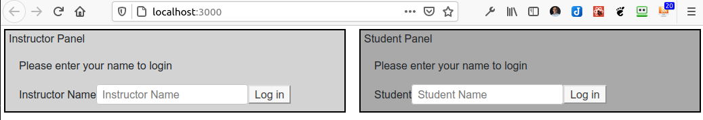
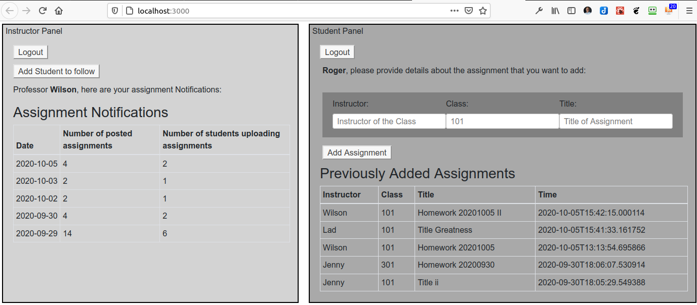
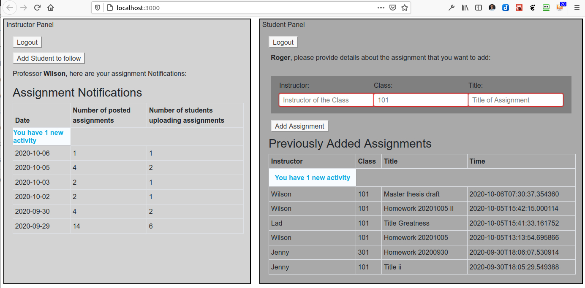
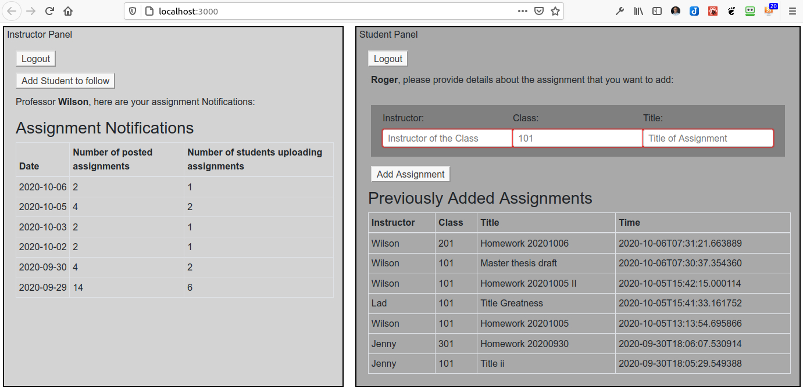
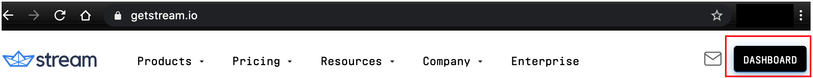
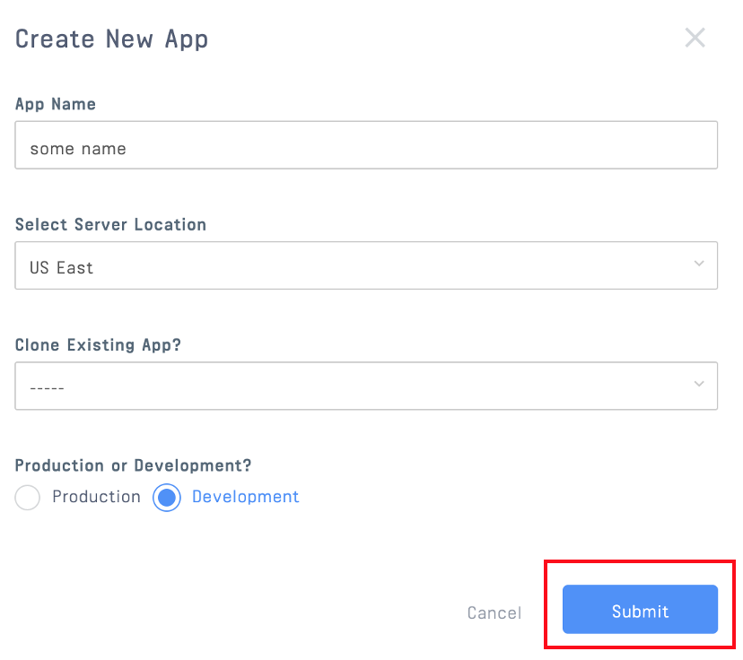
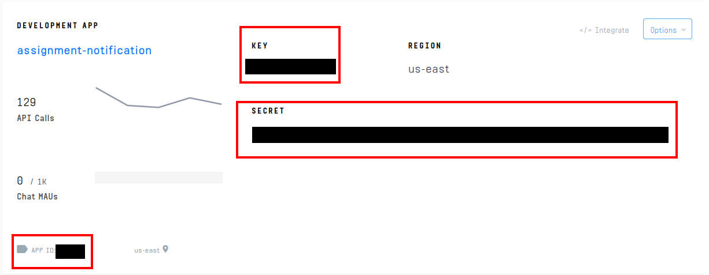
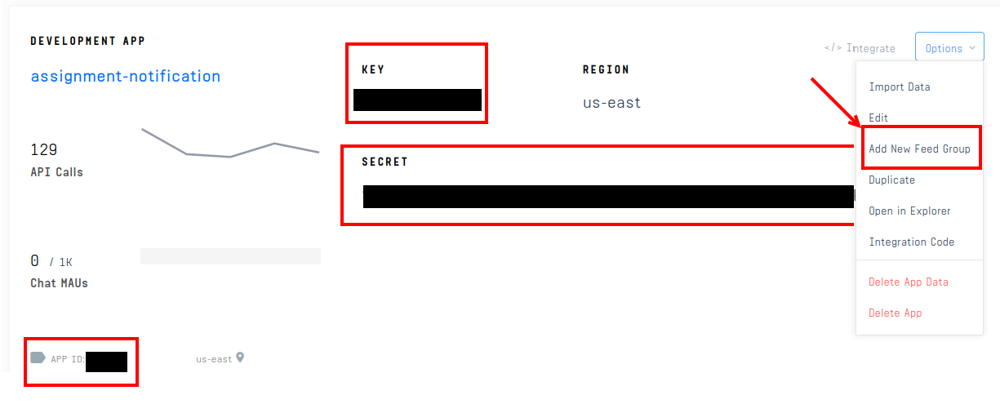
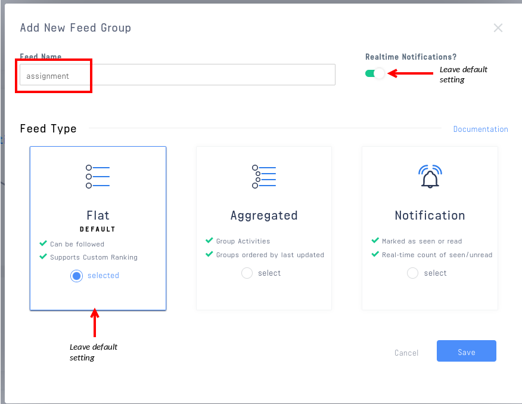
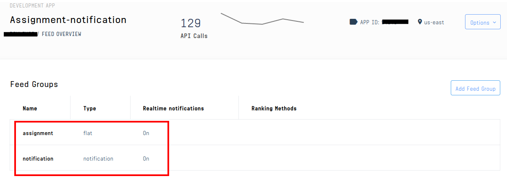

# Notify instructors when students upload new assignments with Get Stream

## Notify Instructors when students upload assignments

This post will demonstrate the ease with which you can integrate Get Stream and leverage their `Notification feed` type to provide notifications to interested user groups. In this case, using the context of an online system where students submit completed assignments by uploading them, to notifiy the corresponding Instructor.

## What the app does

This app provides a complete illustration by showing both sides, instructor and student, when a student adds a new assignment. There are two panels, one for the Instructor and one for the Student. As the student adds new assignments, the instructor's feed is automatically updated. Additionally the instructor panel provides a simple form to allow the instructor to follow other students.

This is a simplified representation and some aspects show here would likely be automated in a real application. For example, setting up the following relationship between an instructor and the students in his/her class would be set up by the application and not by the instructor adding them. We have kept things simple to demonstrate the Get Stream capability.

The following screenshots show the flow of the application. The first one showing the two panels when the app starts:



The following screenshot shows the view after an instructor and student have logged in. The instructor screen shows notifications summarized by date. It also gives the number of students that correspond to the assignments.



In the next screenshot the student, Roger, has just added a new assignemnt for a class with instructor, Wilson. Notice that the new assignment is announced on the instructor panel.



The next screenshot shows the new `notification` total on the instructor panel and the new assignment on the student panel after the new activity notification link has been clicked.



> Note: the source code does not contain any data. You simply log in instructors and students to add new users, and create a `follow` relationship on the instructor panel, to some/all of the student who logged in and added assignments.

## Technical Overview

The app in this post is composed of a `React` frontend and a `nodejs` backend. The `frontend` was bootstrapped using `create-react-app`, and the `backend` server was bootstrapped using `express`. Both `frontend` and `backend` leverage Stream's [JavaScript library](https://GitHub.com/GetStream/stream-js).

All the code required for this tutorial is available in GitHub [GitHub/stream-notification-assignment](https://github.com/keithcrosslin/stream-assignment-notification).

## Prerequisites

To run the app in this post or build it out yourself, you will need a free Stream account (get it [here](https://getstream.io/get_started/?signup=#flat_feed)).

The code in this post is intended to run locally, and assumes a basic knowledge of [React Hooks](https://reactjs.org/docs/hooks-intro.html), [Express](https://expressjs.com/), and [Node.js](https://nodejs.org/en/ "node website").

## The Process Steps

1. [Create and configure your App on Get Stream](#1---create-and-configure-your-app-on-get-stream)
2. [Configure the backend server](#2---configure-the-backend-server)
3. [Build the frontend application](#3---build-the-frontend-application)

## 1 - Create and configure your App on Get Stream

From the Get Stream homepage, click on the **Dashboard** button upper right on the screen.



Then click on the **Create App** buttion


Give your app a name and select **Development** and click **Submit**



Stream will generate a **Key**, **Secret**, and **App ID** for your app. Below we explain that you will copy these and update the corresponding environment variables.



The last step for configuring Get Stream, is to create two feed groups, ne of type `Flat`, and one of type `Notification`. On the Dashboard, click the **Options** dropdown menu and then click **Add New Feed Group**.



You will then see the following screen where you can give it a name of **assignment**, and leave all other default values the same.



Now create another feed group, this time of type `Notification`, again leaving other default values the same. Name this feed group, **notification**. When complete, your **Feed Overview** should like the screenshot below.

## 

Now your Get Stream app is configured and ready to receive calls from your application's `backend` and `frontend` components. We'll build these out next.

---

## 2 - Configure the `backend` server

For the `backend`, please ensure that you have the following dependencies in your `package.json` file.

<!-- https://gist.github.com/keithcrosslin/45dbbaccba297b1b3a6ae66a12e97d91 -->

```jsx
// backend/package.json:8-20
  "dependencies": {
    "axios": "^0.20.0",
    "cookie-parser": "^1.4.5",
    "cors": "^2.8.5",
    "debug": "^2.6.9",
    "dotenv": "^8.2.0",
    "express": "^4.16.4",
    "getstream": "^6.2.0",
    "http-errors": "^1.6.3",
    "jade": "^1.11.0",
    "morgan": "^1.9.1",
    "rss-parser": "^3.9.0"
  }
```

Once the changes in the package.json file are made, run the following command to install the npm dependencies in your `backend`.

```terminal
npm install
```

The first step to configure the `backend`, is to set the three application environment variables:

- STREAM_API_KEY
- STREAM_API_SECRET
- STREAM_APP_ID

You will find a file in the `backend` folder, `.env.example`, that you can rename to create a `.env` file.

To lookup your `Stream` credentials, navigate to your [Stream.io Dashboard](https://getstream.io/dashboard/), as explained in the first section.

One of the files in the `backend` is `routes/index.js`. This is where you will find the code which contains the following four `endpoints`, which respond to `frontend` calls as follows:

- **registration**: sets up a connection with Get Stream and returns a `UserToken` to the `frontend`.
- **follow**: sets the requested `follow` relationship between the instructor's notification feed and the student's assignment feed.
- **following**: generates a list of students that the instructor is following.
- **assignment**: adds the assignment details to the student's assignment feed.

### registation endpoint

<!-- https://gist.github.com/keithcrosslin/403c011b0ba0a8135a9be5c4d5ee9ebb -->

```jsx
// backend/routes/index.js:13-35
router.post("/registration", async (req, res) => {
  try {
    const username = req.body.username.replace(/\s/g, "_").toLowerCase();

    const userToken = client.createUserToken(username);

    await client.user(username).getOrCreate({
      api_key: streamApiKey,
      name: username,
    });

    res.status(200).json({
      userToken,
      streamApiKey,
      username,
      appId,
    });
  } catch (err) {
    console.error(err);
    res.status(500).json({ error: err.message });
  }
});
```

This `registration` router/post defined above, takes the `username` from the `frontend` and uses this value to establish a Stream Session.

### follow endpoint

<!-- https://gist.github.com/keithcrosslin/d09a1d0017563a39982efaf469694db2 -->

```jsx
// backend/routes/index.js:37-51
router.post("/follow", async (req, res) => {
  try {
    const username = req.body.username.replace(/\s/g, "_").toLowerCase();
    const student = req.body.student.replace(/\s/g, "_").toLowerCase();

    const notificationFeed = client.feed("notification", username);
    await notificationFeed.follow("assignment", student);

    res.status(200).json({});
  } catch (err) {
    console.error(err);
    res.status(500).json({ error: err.message });
  }
});
```

The `follow` router takes the 'username' (which is the instructor) and the `student` from the `frontend` and establishes the following relationship between the `notification` feed of `username` and the `assignment` feed of the `student`.

### following endpoint

<!-- https://gist.github.com/keithcrosslin/870d0235e7c47345ccb6bb151d0f429e -->

```jsx
// backend/routes/index.js:37-51
router.get("/following", async (req, res) => {
  try {
    console.log(req.query.username);
    const username = req.query.username.replace(/\s/g, "_").toLowerCase();
    const notificationFeed = client.feed("notification", username);

    let response = await notificationFeed.following();
    let following = response.results
      .map((result) => result.target_id.replace("assignment:", ""))
      .sort()
      .join(", ");

    res.status(200).json(following);
  } catch (err) {
    console.error(err);
    res.status(500).json({ error: err.message });
  }
});
```

The `following` router takes the 'username' (which is also the instructor) and returns a delimited list of students that the instructor is following.

### assignment endpoint

<!-- https://gist.github.com/keithcrosslin/88062c3515f2422e4b604fee2a1244e5 -->

```jsx
// backend/routes/index.js:70-94
router.post("/assignment", async (req, res) => {
  try {
    const username = req.body.username.replace(/\s/g, "_").toLowerCase();
    const instructor = req.body.instructor.replace(/\s/g, "_").toLowerCase();
    const assignmentFeed = await client.feed("assignment", username);
    const verb = "assignment";
    const object = "student assignment";

    await assignmentFeed.addActivity({
      actor: req.body.username,
      verb: verb,
      class: req.body.class,
      title: req.body.title,
      instructor: req.body.instructor,
      object: object,
    });

    res.status(200).send();
  } catch (error) {
    console.log(error);
    res.status(500).json({ error: err.message });
  }
});
```

The `assignment` router takes the 'username' (which is the student in this case), and the assignment parameters `instructor`, `class`, and `title`, and creates a corresponding `Activity` in the `assingment feed`.

---

Ok, so now let's look at how the `frontend` app works.

## 3 - Build the `frontend` application

Before you build the `frontend`, ensure that the following dependencies are found in your `frontend/package.json` file:

<!-- https://gist.github.com/keithcrosslin/494fc31c13a7ec2e07f3d11c898cfd72 -->

```jsx
// frontend/package.json:5-13
  "dependencies": {
    "axios": "^0.20.0",
    "bootstrap": "^4.5.2",
    "react": "^16.13.1",
    "react-activity-feed": "^0.10.2",
    "react-bootstrap": "^1.3.0",
    "react-dom": "^16.13.1",
    "react-scripts": "3.4.3"
  }
```

And as with the `backend`, run `npm install` to ensure the dependencies are present in your application.

Update the standard `src/App.js` file with the following code to setup the two panel starting point.

<!-- https://gist.github.com/keithcrosslin/64c79e39bef2b88674262de6bea02045 -->

```jsx
// frontend/src/App.js:1-23
import React from "react";
import "react-activity-feed/dist/index.es.css";
import "./App.css";
import PanelStudent from "./PanelStudent.js";
import PanelInstructor from "./PanelInstructor.js";

function App() {
  return (
    <div className="panel-main">
      <div className="panel-child left">
        <p>Instructor Panel</p>
        <PanelInstructor></PanelInstructor>
      </div>
      <div className="panel-child right">
        <p>Student Panel</p>
        <PanelStudent></PanelStudent>
      </div>
    </div>
  );
}

export default App;
```

The code for the two panels, one for instructor and one for students, are found in the two files, `frontend/PanelInstructor.js` and `frontend/PanelStudent.js`.

## PanelInstructor.js

The `App` function in `PanelInstructor.js` includes several react hook `const` defintions, four `const function` definitions, and three `function` definitions.

The three `const functions` are summarized below:

- **register**: sends the instructor `username` to the `backend` endpoint, `registration` to create a Get Stream session and return a `UserToken` to the `frontend`.
- **follow**: sends the instructor `username` and the desired student name to the `backend` endpoint follow to establish a following relationship between the student's assignment feed and the intructor's notification feed.
- **following**: sends the instructor username to the `following` endpoint in the `backend` to generate a list of students that the instructor is already following.
- **logout**: to logout the current instructor, reset the `instructorState` (explained below), and return to the login page.

The code snippets for these `const functions` follow:

### register const function

<!-- https://gist.github.com/keithcrosslin/7476f22ecd8071a3ea21c978695fab98 -->

```jsx
// frontend/src/PanelInstructor.js 20-34
const register = async (e) => {
  try {
    e.preventDefault();

    var response = await axios.post("http://localhost:8080/registration", {
      username: username,
    });

    setStreamClient({
      token: response.data.userToken,
      apiKey: response.data.streamApiKey,
      appId: response.data.appId,
    });
    setInstructorState("NOTIFICATION");
  } catch (e) {
    console.error(e, e.error);
  }
};
```

### follow const function

<!-- https://gist.github.com/keithcrosslin/a1ccaccd35a3e33c141df4c5fa77374c -->

```jsx
// frontend/src/PanelInstructor.js 36-53
const follow = async (e) => {
  try {
    e.preventDefault();

    await axios.post("http://localhost:8080/follow", {
      username: username,
      student: studentName,
    });
    setStudentName("");
    let response2 = await axios.post("http://localhost:8080/following", {
      username: username,
    });
    setIntructorFollowing(response2.data);
  } catch (e) {
    console.error(e, e.error);
  }
};
```

### following const function

<!-- https://gist.github.com/keithcrosslin/370c6f1d115246ee50a6779118840598 -->

```jsx
// frontend/src/PanelInstructor.js 55-65
const following = async (e) => {
  try {
    e.preventDefault();
    let response = await axios.get("http://localhost:8080/following", {
      params: { username: username },
    });
    setIntructorFollowing(response.data);
    setInstructorState("FOLLOW");
  } catch (e) {
    console.error(e, e.error);
  }
};
```

### logout const function

<!-- https://gist.github.com/keithcrosslin/b9f340931bb6743c4c85e77e7c1c7516 -->

```jsx
// frontend/src/PanelInstructor.js 67-71
const logout = (e) => {
  setUsername("");
  setStreamClient(null);
  setInstructorState("JOIN");
};
```

The instructor panel has three user interface views, which are controlled by the `react hook` `instructorState`. The three states of the hook are **JOIN**, **NOTIFICATION**, and **FOLLOW**. The first allows Instructor users to logon, the second shows the status of their notifications, and the latter to add new following relationships. There are three corresponding functions, **join**, **notification**, and **followPage** that contain the UI elements of the three states, as follows:

### join function

<!-- https://gist.github.com/keithcrosslin/ab9dcba8220d09ed165b452a933ffa04 -->

```jsx
// frontend/src/PanelInstructor.js 73-93
function join() {
  return (
    <div className="container">
      <form className="login" onSubmit={register}>
        <p>Please enter your name to login</p>
        <div>
          <label>Instructor Name</label>
          <input
            type="text"
            value={username}
            onChange={(e) => setUsername(e.target.value)}
            placeholder="Instructor Name"
            required
          />
          <button type="submit">Log in</button>
        </div>
      </form>
    </div>
  );
}
```

### notification function

<!-- https://gist.github.com/keithcrosslin/fc0a45005f8e6c57b1ec79fd717fd0a8 -->

```jsx
// frontend/src/PanelInstructor.js 95-129
function notification() {
  return (
    <div className="container">
      <div className="button">
        <button onClick={logout}>Logout</button>
      </div>
      <div className="button">
        <button onClick={following}>Add Student to follow</button>
      </div>
      <div ref={containerRef}>
        <p>
          Professor <strong>{username}</strong>, here are your assignment
          Notifications:
        </p>
        <StreamApp
          apiKey={streamClient.apiKey}
          token={streamClient.token}
          appId={streamClient.appId}
        >
          <div className="stream-app">
            <h3 className="app-title">Assignment Notifications</h3>
          </div>
          <Table striped bordered hover size="sm">
            <thead>
              <tr>
                <th>Date</th>
                <th>Number of posted assignments</th>
                <th>Number of students uploading assignments</th>
              </tr>
            </thead>
            <FlatFeed
              feedGroup="notification"
              notify
              options={{ limit: 10 }}
              Activity={PostNotification}
            />
          </Table>
        </StreamApp>
      </div>
    </div>
  );
}
```

### followPage function

<!-- https://gist.github.com/keithcrosslin/1ea0e594515f2cb142c81b52e7401e52 -->

```jsx
// frontend/src/PanelInstructor.js 131-154
function followPage() {
  return (
    <div className="container">
      <div className="button">
        <button onClick={() => setInstructorState("NOTIFICATION")}>
          Return to Notifications
        </button>
      </div>
      <form className="login" onSubmit={follow}>
        <p>Type Student Name to follow</p>
        <div>
          <label>Student Name</label>
          <input
            type="text"
            value={studentName}
            onChange={(e) => setStudentName(e.target.value)}
            placeholder="Student Name"
            required
          />
          <button type="submit">Follow Student</button>
        </div>
      </form>
      <p>
        <strong>Students that you are following:</strong> {instructorFollowing}.
      </p>
    </div>
  );
}
```

Finally, the end of `PanelInstructor.js` has three if statments to evaluate the state of `instructorState` and call the appropriate function, as follows:

### end of PanelInstructor.js

<!-- https://gist.github.com/keithcrosslin/499c85c40417802aaaa47f077caceaf1 -->

```jsx
// frontend/src/PanelInstructor.js 156-166
if (instructorState === "JOIN") {
  return join();
}

if (instructorState === "NOTIFICATION") {
  return notification();
}

if (instructorState === "FOLLOW") {
  return followPage();
}
```

---

## PanelStudent.js

The `App` function in `PanelStudent.js` includes several react hook `const` defintions, three `const function` definitions, and two `function` definitions.

The `register` `const function` sends a request to the `backend` to register the student with Stream and get a `UserToken`. The `assignmentAdd` `const function`, posts the assignment data to be added as an Activity to the `assignment` feed. One last `const function`, `logout`, does just that, it logs the current user out and returns to the respective start screen, instructor or student, that logged out. The code snippets for each of the `const functions` follow:

### register const function

<!-- https://gist.github.com/keithcrosslin/c319c58ccad9bc2225e266b5bb9463fb -->

```jsx
// frontend/src/PanelStudent.js 20-33
const register = async (e) => {
  try {
    e.preventDefault();

    var response = await axios.post("http://localhost:8080/registration", {
      username: username,
    });

    setStudentStreamCredentials({
      token: response.data.userToken,
      apiKey: response.data.streamApiKey,
      appId: response.data.appId,
    });
    setStudentState("ASSIGNMENT");
  } catch (e) {
    console.error(e, e.error);
  }
};
```

### assignmentAdd const function

<!-- https://gist.github.com/keithcrosslin/2cc61f762d85a62ffdb08569b7f35056 -->

```jsx
// frontend/src/PanelStudent.js 36-53
const assignmentAdd = async (e) => {
  try {
    e.preventDefault();
    await axios.post("http://localhost:8080/assignment", {
      username: username,
      title: assignmentTitle,
      class: assignmentClass,
      instructor: assignmentInstructor,
    });

    setAssignmentTitle("");
    setAssignmentInstructor("");
    setAssignmentClass("");
  } catch (e) {
    console.error(e, e.error);
  }
};
```

### logout const function

<!-- https://gist.github.com/keithcrosslin/1426e64c24d4cd8650dca9404fa92ec5 -->

```jsx
// frontend/src/PanelStudent.js 55-59
const logout = (e) => {
  setUsername("");
  setStudentStreamCredentials(null);
  setStudentState("JOIN");
};
```

The student panel has two user interface views, which are controlled by the `react hook` `studentState`. The two states of the hook are **JOIN** and **ASSIGNMENT**. The first allows Student users to logon, and the latter to add new assingments and see a listing of previously added assignments. There are two corresponding functions, **join** and **assignment**, that contain the UI elements of the two states, as follows:

### join function

<!-- https://gist.github.com/keithcrosslin/d87d66cf3552931ba7a915a59b056b0b -->

```jsx
// frontend/src/PanelStudent.js 61-82
function join() {
  return (
    <div className="container">
      <form className="login" onSubmit={register}>
        <p>Please enter your name to login</p>
        <div>
          <label>Student</label>
          <input
            type="text"
            value={username}
            onChange={(e) => setUsername(e.target.value)}
            placeholder="Student Name"
            required
          />

          <button type="submit">Log in</button>
        </div>
      </form>
    </div>
  );
}
```

### assignment function

<!-- https://gist.github.com/keithcrosslin/b5f72ecc0a939a2bb319862bb1eef6d4 -->

```jsx
// frontend/src/PanelStudent.js 84-157
function assignment()
  return (
    <div className="container">
      <div className="button">
        <button onClick={logout}>Logout</button>
      </div>
      <form className="assignment" onSubmit={assignmentAdd}>
        <p>
          <strong>{username}</strong>, please provide details about the
          assignment that you want to add:
        </p>
        <div className="assignmentfields">
          <div className="inputpair">
            <label>Instructor:</label>
            <input
              className="inputField"
              type="text"
              value={assignmentInstructor}
              onChange={(e) => setAssignmentInstructor(e.target.value)}
              placeholder="Instructor of the Class"
              required
            />
          </div>
          <div className="inputpair">
            <label>Class:</label>
            <input
              className="inputField"
              type="text"
              value={assignmentClass}
              onChange={(e) => setAssignmentClass(e.target.value)}
              placeholder="101"
              required
            />
          </div>
          <div className="inputpair">
            <label>Title:</label>
            <input
              className="inputField"
              type="text"
              value={assignmentTitle}
              onChange={(e) => setAssignmentTitle(e.target.value)}
              placeholder="Title of Assignment"
              required
            />
          </div>
        </div>
        <div className="button">
          <button type="submit">Add Assignment</button>
        </div>
      </form>
      <div ref={containerRef}>
        <StreamApp
          apiKey={studentStreamCredentials.apiKey}
          token={studentStreamCredentials.token}
          appId={studentStreamCredentials.appId}
        >
          <div className="stream-app">
            <h3 className="app-title">Previously Added Assignments</h3>
          </div>
          <Table striped bordered hover size="sm">
            <thead>
              <tr>
                <th>Instructor</th>
                <th>Class</th>
                <th>Title</th>
                <th>Time</th>
              </tr>
            </thead>
            <FlatFeed
              feedGroup="assignment"
              notify
              options={{ limit: 10 }}
              Activity={Post}
            />
          </Table>
        </StreamApp>
      </div>
    </div>
  );
}
```

Finally, the tail end of `PanelStudent.js` has a couple of if statments to evaluate the state of `studentState` and call the correct function, as follows:

### end of PanelStudent.js

<!-- https://gist.github.com/keithcrosslin/a49ad9a46308fa64a34f1afa0b405a67 -->

```jsx
// frontend/src/PanelStudent.js 159-165
if (studentState === "JOIN") {
  return join();
}

if (studentState === "ASSIGNMENT") {
  return assignment();
}
```

And that does it! Now you have seen how easy it is to integrate Get Stream Notifications into your applications.
